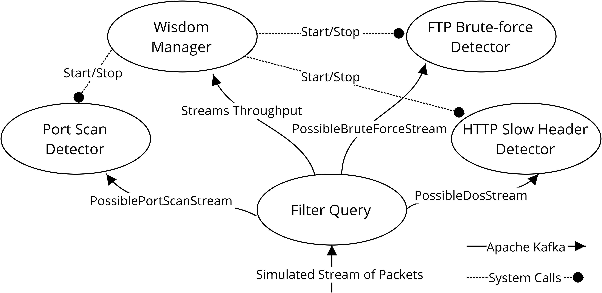

# Functionally Auto-scaling Deployment

Following queries were developed to test functionally auto-scaling deployment of Wisdom for Test 2 in *Real-time Intrusion Detection in Network Traffic Using Adaptive and Self-boosting Stream Processor*.
The following diagram depicts the deployment setup:



## Packet Filter

```java
@app(name='packet_filter', version='1.0.0', priority=10, stats='StatisticsStream', stats_freq=time.sec(5), stats_vars=['port'])

@source(type='kafka', bootstrap='localhost:9092', topic='PacketStream')
def stream PacketStream;

@config(stats=true)
@sink(type='kafka', bootstrap='localhost:9092', topic='PossibleDosStream')
def stream PossibleDosStream;

@config(stats=true)
@sink(type='kafka', bootstrap='localhost:9092', topic='PossibleBruteForceStream')
def stream PossibleBruteForceStream;

@config(stats=true)
@sink(type='kafka', bootstrap='localhost:9092', topic='PossiblePortScanStream')
def stream PossiblePortScanStream;

@sink(type='kafka', bootstrap='localhost:9092', topic='_Statistics')
def stream StatisticsStream;

@query(name='FilterDosAttacks')
from PacketStream
filter 'http' == app_protocol and destPort == 80 and '\r\n\r\n' in data and 'Keep-Alive: \\d+' in data
insert into PossibleDosStream;

@query(name='FilterBruteForceAttacks')
from PacketStream
filter 'FTP[Control]' == app_protocol and '530 Login incorrect' in data
insert into PossibleBruteForceStream;

@query(name='FilterPortScanAttacks')
from PacketStream
filter syn == true and ack == false
insert into PossiblePortScanStream;
```

## FTP Brute Force Attack

```java
@app(name='ftp_detector', version='1.0.0', priority=5, requires=['PossibleBruteForceStream'])

@source(type='http', mapping='json')
@source(type='kafka', bootstrap='localhost:9092', topic='PossibleBruteForceStream')
def stream PossibleBruteForceStream;

@sink(type='file.text', path='/home/gobinath/ftp.txt')
def stream FTPAttackStream;

from PossibleBruteForceStream
    partition by destIp
    window.externalTimeBatch('timestamp', 2940)
    aggregate count() as no_of_packets
    filter no_of_packets >= 3
    select srcIp, destIp, no_of_packets, timestamp
insert into FTPAttackStream;
```

## HTTP Slow Header Attack

```java
@app(name='dos_detector', version='1.0.0', priority=5, requires=['PossibleDosStream'])

@source(type='http', mapping='json')
@source(type='kafka', bootstrap='localhost:9092', topic='PossibleDosStream')
def stream PossibleDosStream;

@sink(type='file.text', path='/home/gobinath/dos.txt')
def stream DosAttackStream;

from PossibleDosStream
    partition by destIp
    window.externalTimeBatch('timestamp', 1189)
    aggregate count() as no_of_packets
    filter no_of_packets >= 3
    select srcIp, destIp, no_of_packets, timestamp
insert into DosAttackStream;
```

## Port Scanning

```java
@app(name='port_scan', version='1.0.0', priority=5, requires=['PossiblePortScanStream'])

@source(type='http', mapping='json')
@source(type='kafka', bootstrap='localhost:9092', topic='PossiblePortScanStream')
def stream PossiblePortScanStream;

@sink(type='file.text', path='/home/gobinath/port.txt')
def stream PortScanStream;

from PossiblePortScanStream
    partition by srcIp, destIp
    window.unique:externalTimeBatch('destPort', 'timestamp', 108)
    aggregate count() as no_of_packets
    filter no_of_packets >= 9
    select srcIp, destIp, no_of_packets, timestamp
insert into PortScanStream;
```